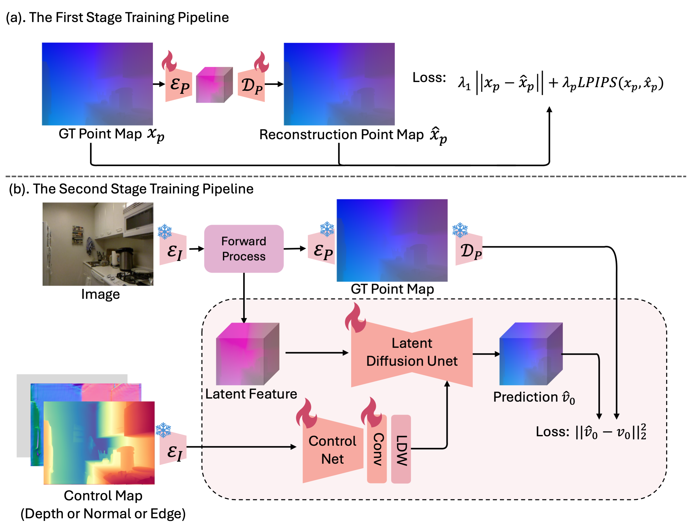
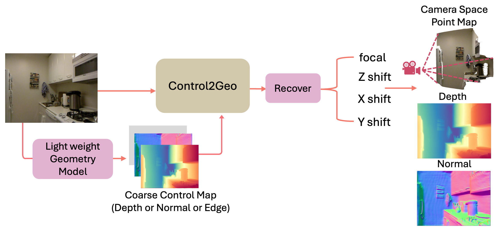

# Control2Geo

Control2Geo is a diffusion-based model for monocular geometry estimation. Given a single RGB image and an explicit geometric control signal, it predicts a camera-space point map, depth map, and surface normal map.

## Abstract
We propose Control2Geo, a diffusion-based model for monocular geometry estimation that recovers 3D geometry from open-domain images with high data efficiency. Control2Geo introduces explicit geometric guidance through a separate pretrained controller, which injects hierarchical cues into the main U-Net without disrupting the pretrained diffusion prior. By formulating estimation as a diffusion bridge from image latent to point-map latent, our framework enables structurally aligned and efficient deterministic inference with only a few sampling steps. To further reduce the domain gap between pretrained image VAEs and 3D point maps, we adopt a simple two-stage training strategy. Using only 61K training samples, which is only 0.67% of the data used by MoGe and 0.1% of the data used by Depth Anything V2, Control2Geo achieves competitive, and in several cases state-of-the-art, performance on multiple zero-shot benchmarks, including NYUv2 and iBims-1, for monocular point map and depth estimation.

<div align="center">
  
</div>

## Inference Pipeline

<div align="center">
  
</div>

## Installation

Create an environment with PyTorch and install the required packages:

```bash
conda create -n control2geo python=3.10 -y
conda activate control2geo

# Choose the PyTorch build that matches your CUDA version.
pip install torch==2.7.0 torchvision==0.22.0 torchaudio==2.7.0 --index-url https://download.pytorch.org/whl/cu128
pip install -r requirements.txt
```

## Model Weights

We provide the depth-control model weight here:

[Baidu Netdisk](https://pan.baidu.com/s/1gWajeI43y3Y31jFEZOu2JQ?pwd=owow), extraction code: `owow`

Download the weight and place it at the repository root as:

```text
model.pth
```

The default config `config/model/test_bridge_control.yaml` expects this path:

```yaml
ckpt_path: 'model.pth'
```

If you store the weight somewhere else, update `ckpt_path` in the config accordingly.

## Prepare Depth Control Maps

For benchmark evaluation, download the test data from [MoGe](https://github.com/microsoft/MoGe). The released depth-control model uses control depth maps generated by [Depth Anything V2](https://github.com/DepthAnything/Depth-Anything-V2).

The following example converts a RGB image into a 16-bit depth control map:

```python
import cv2
import numpy as np
import torch
from PIL import Image
from depth_anything_v2.dpt import DepthAnythingV2

device = "cuda" if torch.cuda.is_available() else "cpu"

model_configs = {
    "vits": {"encoder": "vits", "features": 64, "out_channels": [48, 96, 192, 384]},
    "vitb": {"encoder": "vitb", "features": 128, "out_channels": [96, 192, 384, 768]},
    "vitl": {"encoder": "vitl", "features": 256, "out_channels": [256, 512, 1024, 1024]},
    "vitg": {"encoder": "vitg", "features": 384, "out_channels": [1536, 1536, 1536, 1536]},
}

encoder = "vitb"
model = DepthAnythingV2(**model_configs[encoder])
model.load_state_dict(torch.load(f"depth_anything_v2_{encoder}.pth", map_location="cpu"))
model = model.to(device).eval()

raw_img = cv2.imread("path/to/image.jpg")
depth = model.infer_image(raw_img)
depth = 1.0 - (depth - depth.min()) / (depth.max() - depth.min() + 1e-8)
depth = (depth * 65535).astype(np.uint16)
Image.fromarray(depth).save("path/to/control_depth.png")
```

## Evaluate On Benchmarks

After placing `model.pth` at the repository root and preparing the control maps listed in `data/split/*.csv`, run:

```bash
python scripts/test_model.py \
  --config config/model/test_bridge_control.yaml \
  --data_config config/data/test_data.yaml \
  --output_dir outputs/eval
```

For a quick smoke test:

```bash
python scripts/test_model.py \
  --config config/model/test_bridge_control.yaml \
  --data_config config/data/test_data.yaml \
  --output_dir outputs/eval_smoke \
  --max_samples 1 \
  --skip_visualization
```

## Inference On In-The-Wild Images

Use `scripts/usage_infer.py` for a single image/control pair:

```bash
python scripts/usage_infer.py \
  --config config/model/test_bridge_control.yaml \
  --image path/to/image.jpg \
  --control path/to/control_depth.png \
  --output_dir outputs/demo \
  --infer_steps 10 \
  --size 640 480
```

The script saves:

- `*_vis.png`: RGB image, control map, predicted point map, predicted depth, predicted normal
- `*_control_depth.png`: visualized control map
- `*_points.exr` or `*_points.npy`: raw predicted point map
- `*_depth.exr` or `*_depth.npy`: raw predicted depth

You can also call the model directly:

```python
import torch

from model.utils import create_model
from utils.infer_utils import save_infer_visualization

model_config = "config/model/test_bridge_control.yaml"
image_path = "path/to/image.jpg"
control_path = "path/to/control_depth.png"
save_dir = "outputs/demo"

model = create_model(model_config).cuda()
model.eval()

with torch.no_grad():
    pred_point_map, pred_depth, pred_normal_map = model.infer(
        image_path=image_path,
        control=control_path,
        infer_steps=10,
        size=(640, 480),
    )

saved_paths = save_infer_visualization(
    image_path=image_path,
    control_path=control_path,
    control_key=model.control_key,
    pred_point_map=pred_point_map,
    pred_depth=pred_depth,
    pred_normal_map=pred_normal_map,
    save_dir=save_dir,
    sample_name="demo",
)

print(saved_paths)
```


